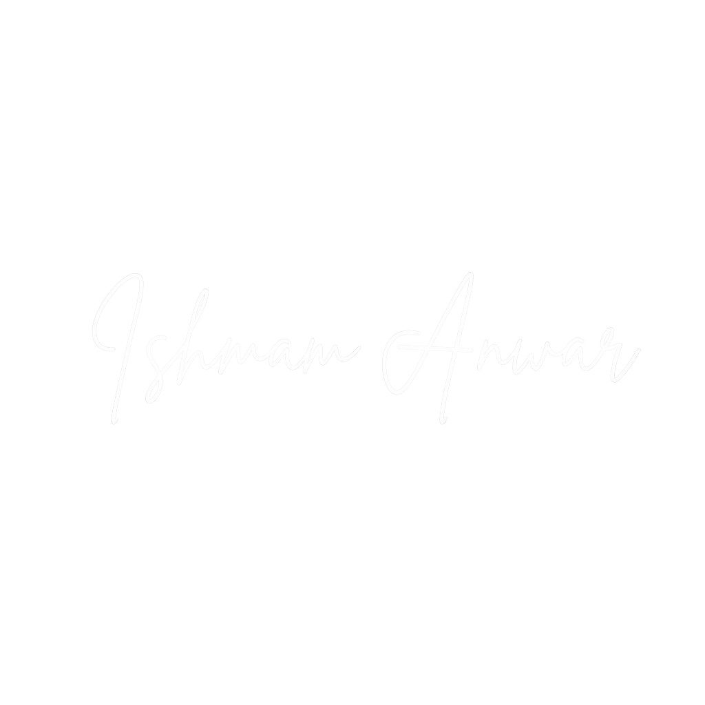

<div align="center">
  
</div>

<h3 align="center">
  A modern, responsive portfolio website showcasing my skills, experience, and projects
</h3>

<h4 align="center">
Technologies used:
</h4>

<p align="center">
    
    
    
    
    
    
    
</p>

## 📋 Table of Contents

1.  ⚙️ [Tech Stack](#tech-stack)
2.  ✨ [Features](#features)
3.  🚀 [Live Application](#live-application)
4.  🛠️ [Deploy Locally](#deploy)
5.  🔄 [GitHub Actions Deployment](#github-actions-deployment)
6.  🎨 [Use This Repository for Your Own Portfolio](#use-for-your-portfolio)

## <a name="tech-stack">⚙️ Tech Stack </a>

👉 **React**: Modern frontend framework with TypeScript for type safety and better development experience

👉 **TypeScript**: Enhanced JavaScript with static typing for better code quality and developer experience

👉 **Vite**: Lightning-fast build tool for modern web development with instant hot module replacement

👉 **Tailwind CSS**: Utility-first CSS framework for rapid UI development and responsive design

👉 **Framer Motion**: Production-ready motion library for React with smooth animations and transitions

👉 **GitHub Pages**: Free hosting platform for static websites with automatic deployment

👉 **GitHub Actions**: Automated CI/CD pipeline for building, testing, and deploying the portfolio to GitHub Pages

## <a name="features">✨ Features</a>

1️⃣ **Responsive Design**: Seamless experience across desktop, tablet, and mobile devices

2️⃣ **Dark/Light Theme**: Toggle between dark and light modes with persistent user preference

3️⃣ **Smooth Animations**: Beautiful page transitions and micro-interactions using Framer Motion

4️⃣ **Interactive Navigation**: Smooth scrolling navigation with mobile-friendly dropdown menu

5️⃣ **Professional Sections**: Well-organized portfolio sections including Hero, Experience, Projects, Skills, and Education

6️⃣ **Modern UI/UX**: Clean, professional design with gradient text effects and hover animations

7️⃣ **Performance Optimized**: Fast loading times with optimized images and efficient code structure

8️⃣ **Accessibility**: Semantic HTML and ARIA labels for better screen reader support

9️⃣ **SEO Ready**: Proper meta tags and structured content for search engine optimization

1️⃣0️⃣ **GitHub Integration**: Seamless deployment with GitHub Pages and Actions

## <a name="live-application">🚀 Live Application</a>

**Visit the deployed portfolio:** [https://ishmamanwar.github.io/](https://ishmamanwar.github.io/)

The portfolio is fully deployed and ready to showcase my work!

## <a name="deploy">🛠️ Deploy locally</a>

Prerequisites:

- [Git](https://git-scm.com/)
- [Node.js](https://nodejs.org/en) (version 16 or higher)
- [npm](https://www.npmjs.com/) (Node Package Manager)

```bash
# Clone the repository
git clone https://github.com/ishmamanwar/ishmamanwar.github.io.git
cd ishmamanwar.github.io

# Install dependencies
npm install

# Start development server
npm run dev

# Build for production
npm run build

# Preview production build
npm run preview
```

## <a name="github-actions-deployment">🔄 GitHub Actions Deployment</a>

This portfolio automatically deploys to GitHub Pages using GitHub Actions. The workflow:

1. **Triggers**: Automatically runs on every push to the main branch
2. **Builds**: Creates a production build using `npm run build`
3. **Deploys**: Automatically deploys the built files to GitHub Pages
4. **Updates**: Your live site updates within minutes of pushing changes

### Workflow File Location

The GitHub Actions workflow is located at: `.github/workflows/deploy.yml`

### Manual Deployment

If you prefer manual deployment:

1. Run `npm run build` locally
2. Copy contents of `dist/` folder to repository root
3. Commit and push changes
4. GitHub Pages will automatically serve the updated content

## <a name="use-for-your-portfolio">🎨 Use This Repository for Your Own Portfolio</a>

This portfolio template is designed to be easily customizable for your personal use! Here's how to adapt it:

### 🖼️ **Customizing Assets**

1. **Profile Picture**: Replace `public/picture.JPG` with your own profile photo
2. **Logo**: Update `public/assets/logo.png` and `public/assets/logo-black.png` with your personal logo
3. **Project GIFs**: Replace the project demonstration GIFs in `public/assets/` with your own:
   - `portfolio-desktop.gif` and `portfolio-mobile.gif` for your portfolio
   - `chomchom-desktop.gif` and `chomchom-mobile.gif` for your projects
   - `sample-desktop.gif` and `sample-mobile.gif` for additional projects

### 📝 **Updating Content**

All the content is stored in TypeScript files under `src/data/`:

- **`site.ts`**: Update site-wide information like your name, title, and contact details
- **`experience.ts`**: Add your work experience, internships, and professional history
- **`projects.ts`**: Showcase your projects with descriptions, technologies, and links
- **`skills.ts`**: List your technical skills organized by category
- **`education.ts`**: Add your educational background and certifications

### 🎯 **Generating Logos with ChatGPT**

The `src/data/logos.tsx` file contains SVG logos for various technologies and companies. I generated this file using ChatGPT by asking it to create SVG logos for different tech stacks.

**To create your own logos.tsx file:**

1. Use ChatGPT or similar AI tools to generate SVG logos for technologies you use
2. Ask for logos in a format that can be easily imported into React components
3. Replace the existing logos with ones relevant to your skill set
4. Ensure the SVGs are optimized and properly formatted for React

### 🚀 **Quick Setup Steps**

```bash
# 1. Fork or clone this repository
git clone https://github.com/ishmamanwar/ishmamanwar.github.io.git
cd ishmamanwar.github.io

# 2. Replace assets with your own
# - Update profile picture
# - Replace logo files
# - Add your project GIFs

# 3. Update content in data files
# - Edit site.ts with your information
# - Update experience.ts with your work history
# - Modify projects.ts with your projects
# - Customize skills.ts with your skills
# - Update education.ts with your background

# 4. Generate your own logos.tsx using ChatGPT
# - Ask ChatGPT to create SVG logos for your tech stack
# - Replace the existing logos.tsx file

# 5. Update package.json with your information
# - Change the name, description, and author fields

# 6. Deploy to your own GitHub Pages
# - Update the repository name in GitHub Actions workflow
# - Push to your repository
```

### 🔧 **Customization Tips**

- **Colors**: Modify the color scheme in `tailwind.config.js` and `src/index.css`
- **Styling**: Customize the design using Tailwind CSS classes throughout the components

### 📱 **Responsive Design**

The portfolio is fully responsive and works on all devices. Test your customizations on:

- Desktop (1920x1080 and above)
- Tablet (768px - 1024px)
- Mobile (320px - 767px)

## Project Structure

```
ishmamanwar.github.io/
├── public/                   # Static assets
│   ├── assets/              # Images and logos
│   └── favicon.ico          # Site favicon
├── src/
│   ├── components/          # Reusable React components
│   │   ├── Header.tsx       # Navigation header
│   │   ├── ThemeToggle.tsx  # Dark/light theme switcher
│   │   └── LoadingScreen.tsx # Initial loading animation
│   ├── sections/            # Main portfolio sections
│   │   ├── Hero.tsx         # Landing section
│   │   ├── Experience.tsx   # Work experience
│   │   ├── Projects.tsx     # Project showcase
│   │   ├── Skills.tsx       # Technical skills
│   │   └── Education.tsx    # Education & certifications
│   ├── data/                # Static data and configuration
│   │   ├── site.ts          # Site-wide configuration
│   │   ├── experience.ts    # Experience data
│   │   ├── projects.ts      # Projects data
│   │   ├── skills.ts        # Skills data
│   │   └── education.ts     # Education data
│   ├── styles/              # Global styles
│   │   └── index.css        # Tailwind CSS and custom styles
│   ├── App.tsx              # Main application component
│   └── main.tsx             # Application entry point
├── index.html               # HTML template
├── package.json             # Dependencies and scripts
├── tailwind.config.js       # Tailwind CSS configuration
├── tsconfig.json            # TypeScript configuration
├── vite.config.ts           # Vite build configuration
└── README.md                # This file
```

## Design Philosophy

This portfolio features a modern, professional design with:

- **Clean typography** with gradient text effects
- **Smooth animations** and micro-interactions
- **Responsive layout** that works on all devices
- **Professional color scheme** with dark/light theme support
- **Intuitive navigation** with smooth scrolling
- **Optimized performance** for fast loading times

## Key Features

- **Hero Section**: Eye-catching introduction with profile picture and call-to-action
- **Experience Timeline**: Professional work history with detailed descriptions
- **Project Showcase**: Featured projects with technologies and live links
- **Skills Display**: Technical skills organized by category
- **Education & Certifications**: Academic background and professional certifications
- **Contact Information**: Easy access to resume, GitHub, and LinkedIn

## Contributing

This is my personal portfolio project. However, if you find any issues or have suggestions:

- Report bugs or issues
- Suggest improvements
- Fork for your own portfolio

## License

This project is licensed under the MIT License - see the [LICENSE](LICENSE) file for details.

This project is developed by Ishmam Anwar.
